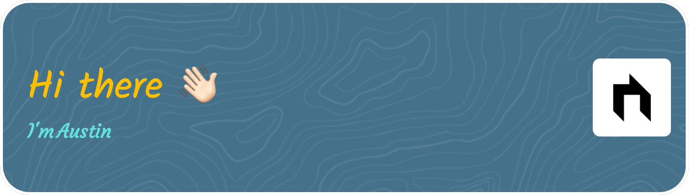

  
  
  

 
   

 

- :rocket: About: I'm Austin Vu. I love spending time to build the application
- :mortar_board: Studying: Java(Spring Boot) And Flutter & React Native.
- :briefcase: <strong>I am currently looking for a job as Fullstack Developer.</strong>

 

<h3 align="left">Languages and Tools:</h3>

    

    

    

    

    

    

    

   

     

   

    

    
  
   

   

  
  

 

  
  

